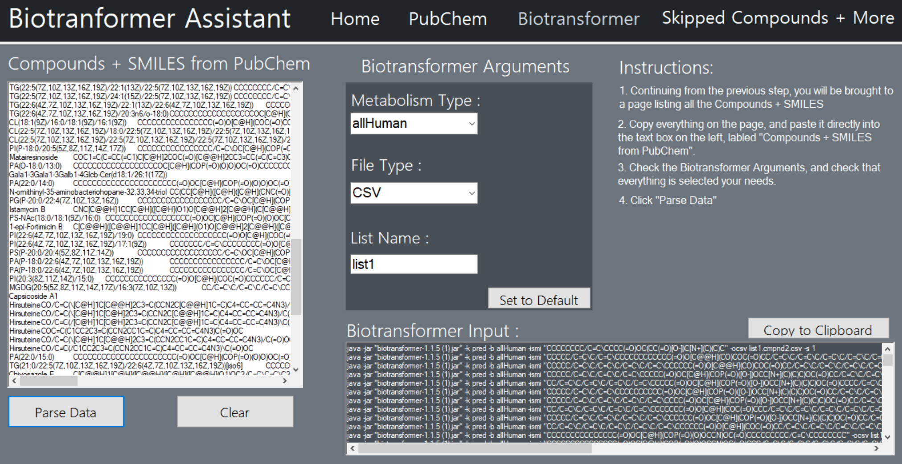

# Biotransformer Assistant GUI
 

# Requirements
Unlike [Biotransformer Assistant](https://github.com/KuebV/Biotransformer-Assistant), this program requires .NET Framework 4.8

You can download .NET Framework 4.8 [Here](https://dotnet.microsoft.com/download/dotnet-framework/thank-you/net48-web-installer)

## Setting up & Starting
Biotransformer Assistant GUI requires almost little to no setup, other than the .NET Framework 4.8

## Using Biotransformer Assistant GUI
Biotransformer Assistant GUI is directly based on [Biotransformer Assistant](https://github.com/KuebV/Biotransformer-Assistant), therefore it's very easy to use if you have used Biotranformer Assistant before

### Wiki
If you seem to be stuck, please visit the Wiki

