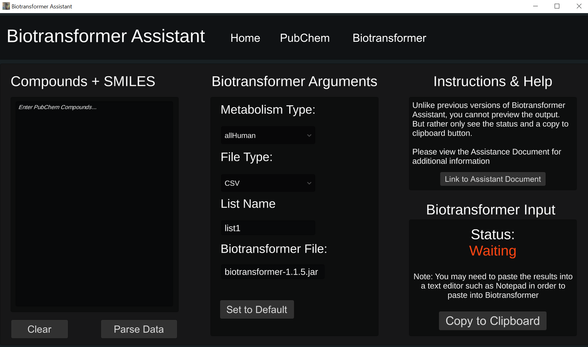

# Biotransformer Assistant GUI
 

# Biotransformer Assistant 3.0
This is the third major overhaul of Biotransformer Assistant.

# Development & Forking
This project does not include the entire codebase for the Application, only the scripts due to their importance. 

## Changes
- Biotransformer Assistant runs off of the Game Engine Unity, for its compatibility with MacOS & Linux operating systems and performance
- Biotransformer Input is no longer in the form of a text box, rather it's just a button to copy it to your clipboard
- Skipped Compounds are now more easily viewable
- Darker theme, to make it better looking and more polished
- Less resource intensive (This was an issue for less powerful hardware when parsing compounds from PubChem)
- More user friendly
- Buttons now highlight when you hover over them:
  - Buttons that highlight red usually mean that pressing them will revert all textboxes / fields on that page
  - Buttons that highlight blue usually mean they process data
- Better SMILES Idenfification
- You are able to input LipidMapsID's, KeggID, and HMDB ID's directly into the skipped compounds fields.

## Ongoing Bugs
- You have to restart Biotransformer Assistant if you wish to input a new set compounds into the Biotransformer Panel
    - [UNSURE IF THIS STILL OCCURS]

## MacOS Installation
As of 12/27/21, the MacOS Installation is being worked on, it should be released upon next update of 3.2 or 3.3

## Windows Installation
Rather than a ZIP file, Biotransformer Assistant comes with a Installation Executable, run the installation, and it will appear in the windows menu
